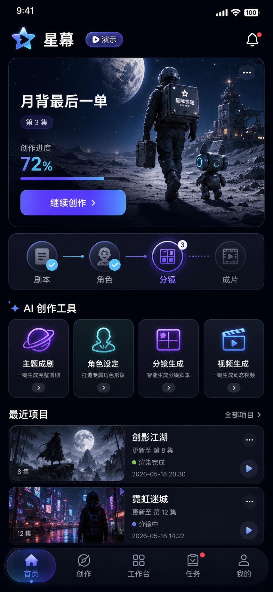

<div align="center">

# 星幕 AI 漫剧工作室

### Flutter Android & HarmonyOS — AI 动态漫剧视频生成

</div>

---

<p align="center">
  
</p>

<div align="center">

**深空主题 · 紫蓝渐变 · 霓虹光效**

</div>

---

## 功能概览

### 核心功能

| 功能 | 说明 |
|------|------|
| **主题成剧** | 输入主题，一键生成完整漫剧剧本 + 角色 + 分镜 |
| **角色设定** | 打造专属角色形象，保持跨镜头连续性 |
| **分镜生成** | 智能拆分镜头，生成首尾帧图片 |
| **视频生成** | 万相 2.7 图生视频 + FFmpeg 合成 |
| **配音工作室** | TTS 多角色配音 + 音轨混音 |
| **任务中心** | 实时追踪生成任务状态 |
| **成片预览** | MP4 播放 + 导出 |

### 扩展功能（阶段一~三）

| 功能 | 说明 |
|------|------|
| **文件导入与脚本解析** | 支持 .txt / .md / .json 剧本导入，自动拆分场景与角色 |
| **多 Provider 抽象层** | 统一接口适配 DashScope / 百炼 / OpenAI 等 AI 服务商 |
| **管线状态机** | 8 阶段流水线（剧本→角色→分镜→镜头→配音→合成→发布），支持依赖编排与并行执行 |
| **角色锁脸** | IP-Adapter 锚点锁定 + 漂移检测，确保跨镜头角色一致性 |
| **运镜规划** | 8 种运镜类型（推/拉/平移/俯仰/ Ken Burns），含缓动函数 |
| **字幕卡点** | 毫秒级时间戳计算，SRT / ASS 字幕导出 |
| **Multi-Agent 架构** | Hub-and-Spoke 模型，MasterDirectorAgent 编排 + 专业化子 Agent |
| **自定义 Agent 扩展** | 模板化创建 Agent（风格增强/镜头优化/台词润色/配乐选择） |
| **多轨混音** | 多轨道混音台（音量/声像/静音/独奏/淡入淡出/效果链） |
| **GPU 加速渲染** | 自动检测 NVENC / AMF / QSV / VideoToolbox，可配置编码器与质量预设 |
| **Keyring 加密存储** | 主密码加密保险库（AES-256-GCM），凭据 CRUD + 审计日志 + .env 导入导出 |

## 首页设计

首页采用深空暗色主题，核心区域包括：

- **当前项目卡片** — 科幻插画封面 + 创作进度条 + 继续创作按钮
- **创作流程指示器** — 剧本 ✓ → 角色 ✓ → 分镜（当前）→ 成片（待完成）
- **AI 创作工具** — 四宫格快捷入口
- **最近项目** — 漫剧列表 + 状态标签 + 播放按钮
- **底部导航** — 首页 / 创作 / 工作台 / 任务 / 我的

## 界面展示

App 内 "月背最后一单" 项目的界面与 AI 生成素材：

| | | |
|:---:|:---:|:---:|
|  |  |  |
|  |  |  |

## 架构

### 分层架构

```
┌─────────────────────────────────────────────┐
│  Presentation Layer (UI)                     │
│  features/*/presentation/  +  adapters/      │
├─────────────────────────────────────────────┤
│  Application Layer (Controller)               │
│  application/  +  features/*/application/     │
├─────────────────────────────────────────────┤
│  Domain Layer (Model + Repository)            │
│  domain/  +  features/*/domain/              │
├─────────────────────────────────────────────┤
│  Data Layer (Remote + Demo)                  │
│  data/remote/  +  data/demo/                 │
└─────────────────────────────────────────────┘
```

### Multi-Agent 编排架构

```
                   ┌──────────────────┐
                   │ MasterDirector   │
                   │     Agent        │
                   └────────┬─────────┘
                            │
                   ┌────────┴─────────┐
                   │ ProjectBlackboard │
                   │  (共享状态总线)    │
                   └────────┬─────────┘
                            │
        ┌───────┬───────┬───┴───┬───────┬───────┐
        ▼       ▼       ▼       ▼       ▼       ▼
  Script   Character  Story  Camera  Voice  Custom
  Ingest   Designer   board  Motion  Sync   Agents
  Agent    Agent      Agent  Agent   Agent
```

### 管线状态机

```
ingestion → script → characters → storyboard → shots → voice → compose → publish
    │           │          │            │          │        │         │
    └─ approval ┘ └ approval┘  └ approval ┘  └ approval┘ └ approval┘
```

## 项目结构

```
lib/
├── main.dart                        # 应用入口
├── app/                             # 应用根组件
│   ├── app.dart
│   └── xingmu_app.dart
├── application/                     # 应用引导与全局控制器
│   ├── studio_bootstrap.dart        # 启动引导（环境变量 + 依赖注入）
│   └── studio_controller.dart       # 项目级状态控制器
├── data/                            # 数据层
│   ├── demo/                         # 演示数据源
│   └── remote/                       # 远程 HTTP 仓库 + API 异常
├── domain/                           # 领域层
│   ├── agents/                       # Multi-Agent 架构
│   │   ├── agent_registry.dart       # Agent 注册表
│   │   ├── base_agent.dart           # Agent 基类
│   │   ├── builtin_agents.dart       # 内置 Agent
│   │   ├── custom_agent.dart         # 自定义 Agent 定义
│   │   ├── master_director_agent.dart # 编排 Agent
│   │   └── project_blackboard.dart   # 共享状态总线
│   ├── pipeline/                     # 管线状态机
│   │   ├── pipeline_definition.dart  # 8 阶段定义
│   │   ├── pipeline_event.dart       # 管线事件
│   │   └── pipeline_runner.dart      # 执行引擎
│   ├── providers/                    # 多 Provider 抽象
│   │   ├── base_provider.dart        # Provider 基类
│   │   ├── provider_selectors.dart   # 服务商选择器
│   │   └── cost_table.dart          # 成本估算表
│   ├── studio_models.dart            # 核心数据模型
│   ├── studio_repository.dart        # 仓库接口
│   ├── generation_planner.dart       # 生成计划器
│   ├── studio_status.dart            # 状态枚举
│   └── studio_validation.dart        # 验证逻辑
├── features/                         # 功能模块
│   ├── agent_builder/                # 自定义 Agent 扩展
│   │   ├── domain/                    # 模板 + 定义
│   │   ├── application/               # CRUD 控制器
│   │   └── presentation/             # 双 Tab 界面
│   ├── character_consistency/        # 角色锁脸
│   │   └── domain/                    # 锚点 + 漂移检测
│   ├── home/                         # 首页
│   ├── creation/                     # 主题成剧
│   ├── ingestion/                    # 文件导入与解析
│   │   ├── domain/                    # 导入模型 + 仓库接口
│   │   ├── data/                      # 文件解析仓库
│   │   └── presentation/            # 导入界面
│   ├── keyring/                      # 加密存储
│   │   ├── domain/                    # 凭据模型 + 加密仓库
│   │   ├── application/               # 密钥库控制器
│   │   └── presentation/             # 凭据管理界面
│   ├── multi_track_voice/            # 多轨混音与 GPU 渲染
│   │   ├── domain/                    # 混音 + 渲染模型
│   │   ├── application/               # 混音 + GPU 控制器
│   │   └── presentation/             # 混音台界面
│   ├── script/                       # 剧本
│   ├── storyboard/                   # 分镜与运镜
│   │   └── domain/                    # 运镜类型 + 分镜规划
│   ├── shots/                        # 分镜工作台
│   ├── voice/                        # 配音工作室
│   ├── voice_sync/                   # 字幕卡点
│   │   ├── domain/                    # 时间轴 + SRT/ASS 导出
│   │   └── application/               # 同步控制器
│   ├── video_lab/                    # 视频实验室
│   ├── result/                       # 成片预览
│   ├── settings/                     # 设置
│   ├── tasks/                        # 任务中心
│   └── assets/                       # 视觉素材
├── presentation/                     # 表示层
│   ├── adapters/                     # 视图适配器
│   └── models/                       # 视图数据模型
└── shared/                          # 共享组件
    ├── theme/                        # 星幕深空主题
    └── widgets/                      # 通用 Widget
```

## 后端服务

`services/basic_video_server/` — Python 后端服务：

| 服务 | 技术 | 说明 |
|------|------|------|
| 视频生成 | 万相 Wan 2.7 i2v | 图生视频 AI 推理 |
| 视频合成 | FFmpeg | 漫剧合成 + 转场 + 字幕烧录 |
| 语音合成 | TTS | 多角色配音生成 |

## 安全说明

- API Key 通过环境变量注入，不硬编码在源码中
- `.env` / `.env.*` 文件不入 Git（已配置 `.gitignore`）
- Keyring 加密存储使用 AES-256-GCM 加密，密钥仅存于本地设备

### 环境变量

| 变量 | 说明 |
|------|------|
| `DASHSCOPE_API_KEY` | 百炼 API 密钥 |
| `BAILIAN_WORKSPACE_ID` | 百炼工作空间 ID |
| `API_BASE_URL` | 后端服务地址 |

## 技术栈

| 层 | 技术 |
|----|------|
| **前端框架** | Flutter (Dart 3.x) |
| **平台** | Android / HarmonyOS (OHOS) |
| **后端** | Python (FastAPI) |
| **AI 服务** | 阿里云百炼（通义万相 Wan 2.7） |
| **视频合成** | FFmpeg |
| **GPU 加速** | NVENC / AMF / QSV / VideoToolbox |
| **加密存储** | AES-256-GCM / ChaCha20-Poly1305 |
| **状态管理** | ChangeNotifier + InheritedWidget |
| **架构模式** | MVVM + Repository + DDD 分层 |

## 开发阶段

| 阶段 | 版本 | 内容 |
|------|------|------|
| **阶段一** | v0.5.0 | 文件导入 + 多 Provider 抽象 + 管线状态机 |
| **阶段二** | v1.0.0 | 角色锁脸 + 运镜规划 + 字幕卡点 + Multi-Agent 架构 |
| **阶段三** | v1.5.0 | 自定义 Agent 扩展 + 多轨混音 GPU 渲染 + Keyring 加密存储 |

## 许可证

MIT License + 商业双许可

Copyright (c) 2026 w6521939 <w6521939@gmail.com>
