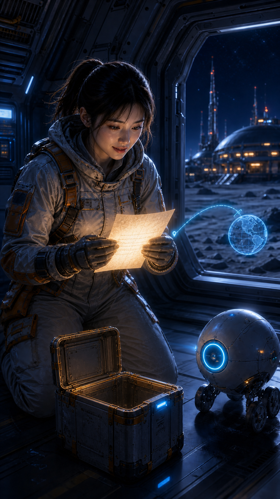

<div align="center">

# 星幕 AI 漫剧工作室

### Flutter Android & HarmonyOS 客户端 — AI 动态漫剧视频生成

</div>

---

<p align="center">
  
</p>

<div align="center">

**深空主题 · 紫蓝渐变 · 霓虹光效**

</div>

---

## 功能概览

| 功能 | 说明 |
|------|------|
| **主题成剧** | 输入主题，一键生成完整漫剧剧本 + 角色 + 分镜 |
| **角色设定** | 打造专属角色形象，保持跨镜头连续性 |
| **分镜生成** | 智能拆分镜头，生成首尾帧图片 |
| **视频生成** | 万相 2.7 图生视频 + FFmpeg 合成 |
| **配音工作室** | TTS 多角色配音 + 音轨混音 |
| **任务中心** | 实时追踪生成任务状态 |
| **成片预览** | MP4 播放 + 导出 |

## 首页设计

首页采用深空暗色主题，核心区域包括：

- **当前项目卡片** — 科幻插画封面 + 创作进度条 + 继续创作按钮
- **创作流程指示器** — 剧本 ✓ → 角色 ✓ → 分镜（当前）→ 成片（待完成）
- **AI 创作工具** — 四宫格快捷入口
- **最近项目** — 漫剧列表 + 状态标签 + 播放按钮
- **底部导航** — 首页 / 创作 / 工作台 / 任务 / 我的

## 漫剧素材展示

以下为 App 内 "月背最后一单" 项目的 AI 生成概念插画：

<p align="center">
  
  
  
</p>

<p align="center">
  
  
  
</p>

<p align="center">
  
</p>

## 项目结构

```
lib/
├── main.dart                    # 应用入口
├── app/                         # 应用根组件
│   ├── app.dart
│   └── xingmu_app.dart          # 星幕 App 根 Widget
├── application/                 # 应用引导与控制器
│   ├── studio_bootstrap.dart      # 启动引导（环境变量读取 API_BASE_URL）
│   └── studio_controller.dart    # 状态控制器
├── data/                        # 数据层
│   ├── demo/                     # 演示数据源
│   └── remote/                   # 远程 HTTP 仓库
├── domain/                      # 领域层
│   ├── studio_models.dart        # 数据模型
│   ├── studio_repository.dart    # 仓库接口
│   ├── generation_planner.dart   # 生成计划器
│   ├── studio_status.dart        # 状态枚举
│   └── studio_validation.dart    # 验证逻辑
├── features/                    # 功能模块
│   ├── home/                     # 首页
│   ├── creation/                # 主题成剧
│   ├── script/                   # 剧本
│   ├── shots/                    # 分镜工作台
│   ├── voice/                    # 配音工作室
│   ├── video_lab/               # 视频实验室
│   ├── result/                   # 成片预览
│   ├── settings/                # 设置
│   ├── tasks/                   # 任务中心
│   └── assets/                  # 视觉素材
├── presentation/               # 表示层适配
│   ├── adapters/                 # 适配器
│   └── models/                   # 视图数据
└── shared/                     # 共享组件
    ├── theme/                    # 星幕深空主题
    └── widgets/                  # 通用 Widget
```

## 后端服务

`services/basic_video_server/` — Python 后端服务，负责：

- 万相视频生成（Wan 2.7 i2v）
- FFmpeg 漫剧合成
- TTS 配音

## 安全说明

- 所有 API Key 通过环境变量注入，不硬编码在源码中
- `DASHSCOPE_API_KEY` — 百炼 API 密钥
- `BAILIAN_WORKSPACE_ID` — 百炼工作空间
- `API_BASE_URL` — 后端服务地址

## 技术栈

| 层 | 技术 |
|----|------|
| **前端** | Flutter (Dart 3.9) |
| **平台** | Android / HarmonyOS (OHOS) |
| **后端** | Python (FastAPI) |
| **AI 服务** | 阿里云百炼（通义万相 Wan 2.7） |
| **视频合成** | FFmpeg |
| **状态管理** | StudioController + InheritedWidget |

## 许可证

Apache License 2.0
