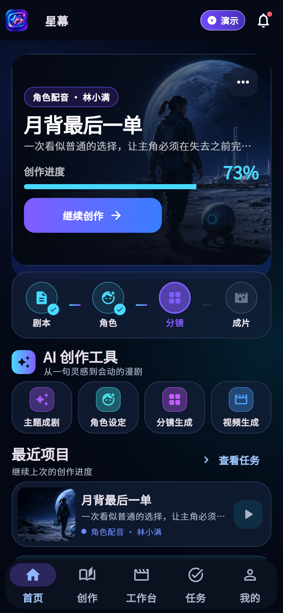
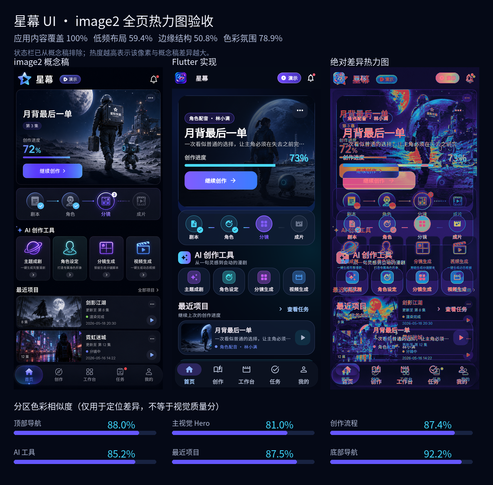

# 星幕 AI 漫剧

使用 Flutter 编写的 AI 漫剧视频生成手机客户端，同时支持 Android 与 OpenHarmony。

用户可以在手机上输入主题与故事创意、审核角色与场景设定、查看生成任务并重试失败镜头。直接导入完整剧本尚未接入。文生图、图生视频、TTS 和成片合成都运行在可信后端，**不会在手机本地推理，也不会把模型 API Key 放进客户端**。

## 产品能力

- 项目首页与最近生成任务
- 主题/故事创意输入和结构化剧本任务；完整剧本导入待接入
- 角色卡、场景卡、道具卡与连续性描述；锁定状态仅展示服务端明确数据，锁定变更待接入
- 分镜、首尾帧、镜头视频和配音生成队列
- 暂停/恢复/取消和失败重试
- 预算预估与硬上限已写入 OpenAPI，客户端页面仍待接入
- REST 刷新、暂停/恢复及任务失败重试；SSE 增量事件仍是后续能力
- 成片元数据、演示预览与 Video Lab 最终 MP4 内嵌播放；生产导出下载和系统分享仍是后续能力
- 漫剧快制实验室：分别选择文本、图片、视频和声音处理方式，查看三镜头/分阶段任务；GIF 只作预览，MP4 才是最终成片
- 免费本地模板固定使用项目自有的 `《月背最后一单》` 三张画面，通过 Windows 系统 TTS 与 FFmpeg 生成真实配音、字幕、镜头运动和成片
- 本地结果明确返回 `executionKind=template`、`generatedForRequest=false`、`containsAiGeneratedAssets=true` 与 `assetProvenance=openai_imagegen_project_assets`；本次任务不调用 AI，画面使用预先生成且有来源记录的 ImageGen 项目素材，输入不同故事不会重新绘制
- 可选 Wan 2.7 hybrid：以三组固定首尾帧生成三段供应商 MP4，再本地配音、字幕和合片；只在受信服务端显式启用且存在 Key 时可用
- 最终 MP4 使用 Flutter `video_player` 内嵌播放页查看；GIF 仅用于快速预览，不代替成片播放
- 千问脚本、Wan 首尾帧重绘和 CosyVoice Adapter 仍未实现；Wan 付费调用、费用和效果尚未运行，手机不代收款
- 不联网、不收费的确定性演示模式

默认后端 Provider 是阿里云百炼；部署方可以通过相同服务端接口接入 Wan2.2。客户端只调用星幕可信后端，不直接调用任何模型供应商。

## 手机界面



截图来自 2026-08-20 较早的确定性演示快照，界面持续显示“演示”，不代表模型已经生成真实视频。后续代码已进一步收紧远程进度、资产锁定和未接入操作的说明文案，因此实际文案可能与该图不同；图中布局与视觉方向仍是本次 image2 验收对象。

### image2 设计落地验收



概念稿的系统状态栏不属于 Flutter 页面，分析时将其排除；其余应用内容区域 100% 参与比较。该设计验收快照的色彩氛围相似度为 78.9%、低频布局相似度为 59.4%、边缘结构 F1 为 50.8%。这些指标用于定位布局与设计差异，不代表最终文案逐字同步、100% 像素一致或产品质量评分。

## 架构

```text
Flutter Android / OpenHarmony
  ├─ 生产：HTTPS REST（SSE 契约已预留，客户端尚未接入）
  │    -> 星幕可信后端
      -> 百炼（默认）或 Wan2.2（可选）
      -> 对象存储 + 任务队列 + TTS/字幕 + FFmpeg 成片
  └─ 本地实验：Video Lab REST
       ├─ 本地模板：固定三帧 -> Huihui + FFmpeg -> 配音 MP4
       └─ hybrid：固定三组首尾帧 -> Wan 2.7 三段 MP4
                    -> Huihui + FFmpeg -> shot_videos_concat 最终 MP4
                    -> GIF 仅为预览
```

- [MVP 需求](docs/requirements/mvp.md)
- [架构说明](docs/architecture/overview.md)
- [OpenAPI 契约](docs/api/openapi.yaml)
- [本地 Video Lab 契约](docs/api/video-lab-openapi.yaml)
- [安全与隐私基线](docs/security.md)

## 开发环境

### 通用要求

- Git
- Flutter/Dart
- Android Studio 或具备 Android SDK 的命令行环境
- DevEco Studio 和 OpenHarmony SDK API 20

### OpenHarmony 固定工具链

- Flutter fork：`https://gitcode.com/CPF-Flutter/flutter_flutter.git`
- 分支：`oh-3.35.7-dev`
- 已知版本：`Flutter 3.35.8-ohos-1.0.3-beta`
- OpenHarmony SDK：API 20
- `HDC_SERVER_PORT=7035`

### 成片播放依赖

- `video_player` 2.10.1 通过 `https://gitcode.com/CPF-Flutter/flutter_packages.git` 引入，固定 commit `97e9265ae2ab44c913d5d943ad68bec0c07a040e`、path `packages/video_player/video_player`。
- 该 CPF package 内部的 `video_player_ohos` 指向 `https://gitcode.com/openharmony-tpc/flutter_packages.git` 的同一 commit，用于 OpenHarmony 平台播放适配。
- Flutter 上游 `video_player` 与 CPF/OpenHarmony 适配的来源、BSD-3-Clause 许可和分发边界见 [THIRD_PARTY_NOTICES.md](THIRD_PARTY_NOTICES.md)。

建议环境变量：

```text
DEVECO_SDK_HOME=<OpenHarmony SDK 根目录>
HOS_SDK_HOME=<OpenHarmony SDK 根目录>
HDC_HOME=<OpenHarmony SDK 根目录>\default\openharmony\toolchains
HDC_SERVER_PORT=7035
FLUTTER_GIT_URL=https://gitcode.com/CPF-Flutter/flutter_flutter.git
```

`android/local.properties` 和 `ohos/local.properties` 仅保存本机 SDK 路径，已被 Git 忽略。签名、`key.properties`、keystore、`.env` 和供应商密钥也不得提交。

## 快速启动

安装依赖：

```powershell
flutter pub get
```

以演示模式运行，不连接后端、不产生费用：

```powershell
flutter run --dart-define=DEMO_MODE=true
```

演示模式只用于产品流程和双平台 UI 验证，演示进度与占位成片不能宣称为真实 AI 生成结果。

## 本地三镜头模板与 Wan hybrid

仓库包含 `services/basic_video_server` 本地开发服务。它借鉴 [MoneyPrinterTurbo](https://github.com/harry0703/MoneyPrinterTurbo) 的异步任务/轮询思路，但实现为独立代码，不复制其源码、品牌或素材。免费路径调用 Windows 系统 TTS 与开发机 FFmpeg，将三张固定画面合成 9:16 H.264/AAC MP4。Wan hybrid 路径使用六张项目自有首尾帧生成三段真实镜头 MP4，随后立即转存、标准化并按顺序合片。两种路径的 GIF 都只是预览，不是最终成片。

本地模板故事名固定为 `《月背最后一单》`，素材位于 `assets/showcase/motion_comic/`。用户提交的故事不会触发重新绘图，也不能据此声称角色画面由该主题生成；客户端必须展示服务端返回的 `visualWarning`，并以 `executionKind=template`、`visualSource=fixed_project_assets`、`generatedForRequest=false` 标明本次任务未调用模型，同时以 `containsAiGeneratedAssets=true`、`assetProvenance=openai_imagegen_project_assets` 如实标明画面来自预先生成的 ImageGen 项目素材。

hybrid 仍使用同一固定剧本和首尾帧，但返回 `executionKind=hybrid`、`generatedForRequest=true`、`modelExecution={text: local, image: pre_generated, video: cloud, voice: local}`。这里的 `true` 只表示本次生成了三段镜头视频，不表示首尾帧会按 `story` 重绘。成功输出还会声明 `compositionType=shot_videos_concat` 与 `sourceClipCount=3`。

创建任务固定为 3 个镜头、每镜头 3 秒、9:16，故事限制为 4–500 字。服务每个进程最多接受 2 个排队/执行任务并保留 20 个任务，超限返回 HTTP 429；原生客户端不需要 CORS，因此服务不返回跨域允许头。它没有认证，只能监听受信开发环境，不能暴露公网。

启动服务：

```powershell
python services/basic_video_server/server.py --host 127.0.0.1 --port 8787
```

Wan hybrid 必须由受信服务端操作者显式启用：

```powershell
$env:XINGMU_WAN_ADAPTER_ENABLED = "true"
$env:DASHSCOPE_API_KEY = "<server-side secret>"
$env:BAILIAN_WORKSPACE_ID = "<optional Beijing workspace id>"
python services/basic_video_server/server.py --host 127.0.0.1 --port 8787
```

也可显式传入 `--dashscope-key-file <受控服务端路径>`。服务不会自动搜索 `key.txt`，更不会默认读取 D 盘或原 Electron 项目的任何密钥。Key 不得进入 Flutter、Git、请求/响应、日志或生成清单。

Android 模拟器连接开发机：

```powershell
flutter run -d <android-device-id> `
  --dart-define=DEMO_MODE=true `
  --dart-define=VIDEO_LAB_URL=http://10.0.2.2:8787/v1 `
  --dart-define=ALLOW_INSECURE_VIDEO_LAB=true
```

OpenHarmony 使用设备实际可达的局域网地址或经过验证的 HDC 端口映射，不能照抄 Android 的 `10.0.2.2`。开发期 HTTP 必须显式设置 `ALLOW_INSECURE_VIDEO_LAB=true`；生产服务必须改用 HTTPS、认证、对象授权与限流。

当前模型目录按四类能力展示。Wan 视频 Adapter 已实现为受控 hybrid 能力；其他云选项仍只是入口：

| 能力 | 选项 | 状态 | 费用边界 |
| --- | --- | --- | --- |
| 文本 | 本地三镜头脚本模板 | 本机检测后可用 | 免费，不调用模型；固定模板故事 |
| 文本 | `qwen3.6-plus` | 后端未配置 | 付费；只提供厂商官方计费/充值链接 |
| 图片 | 固定月球快递画面 | 本机检测后可用 | 免费；不会随任意输入重新绘制 |
| 图片 | `wan2.7-image-pro` | 后端未配置 | 付费；真实图片 Adapter 尚未实现 |
| 视频 | 本地 FFmpeg 三镜头漫剧 | 本机检测后可用 | 免费；真实媒体合成，但不是 AI 视频生成 |
| 视频 | `wan2.7-i2v-2026-04-25` | 默认未配置；显式 enable + 服务端 Key 后可用 | 付费；只生成三段镜头视频，不重绘首尾帧 |
| 声音 | Windows 系统中文语音 | 本机检测后可用 | 免费；依赖 Windows 主机已安装声线 |
| 声音 | `cosyvoice-v3.5-plus` | 后端未配置 | 付费；真实 TTS Adapter 尚未实现 |

模型计费会变化，客户端不硬编码单价。请以[阿里云百炼官方模型价格](https://help.aliyun.com/zh/model-studio/model-pricing)和[阿里云官方充值说明](https://help.aliyun.com/zh/user-center/use-alipay-online-banking-to-recharge-online)为准。点击“充值入口”只复制官方地址供系统浏览器打开；App 不收款，不收集银行卡、支付凭据或模型 API Key。

完整百炼主题生成的目标链路是千问脚本、Wan 重绘首尾帧、Wan 镜头视频、CosyVoice 配音和后期合成。当前只实现其中的 Wan 首尾帧图生视频 Adapter，且输入仍是六张固定项目素材；千问、图片重绘和 CosyVoice 仍未实现。`DASHSCOPE_API_KEY` 不能从 Flutter 请求传入，只能位于受信服务端。Wan 真实付费调用、实际费用和效果当前均为 `not run`。

## 连接开发后端

当前仓库没有手机登录页，也不会把访问令牌放进 `--dart-define`。因此默认入口只直接启动演示模式；真实模式必须由宿主登录层取得短期 Bearer Token，并通过 `XingmuApp(controller: ...)` 注入已认证的 `StudioController`。只传 `API_BASE_URL` 会在联网前显示配置错误，这是有意的安全边界。

以下地址只用于登录层和 HTTP Repository 的本地联调。Android 模拟器访问开发电脑不能使用 `localhost`，应使用 `http://10.0.2.2:8080/v1`。登录成功后由宿主组装：

```dart
final repository = HttpStudioRepository(
  baseUri: Uri.parse('http://10.0.2.2:8080/v1'),
  accessTokenProvider: session.readShortLivedAccessToken,
  allowInsecureTransport: true, // 仅 debug
);
runApp(XingmuApp(
  demoMode: false,
  apiBaseUrl: repository.baseUri.toString(),
  controller: StudioController(repository: repository),
));
```

Android 仅在 debug manifest 中允许开发期明文 HTTP。main/release 没有明文放行。

OpenHarmony 真机或模拟器必须使用设备实际可达的开发机局域网地址或调试端口映射，例如：

```powershell
API_BASE_URL=http://192.168.1.10:8080/v1
```

不要照抄示例 IP；先从设备确认该地址和端口可访问。OpenHarmony 是否允许开发期 HTTP 取决于本地网络安全配置，生产环境统一使用 HTTPS。

宿主登录层接入后，生产构建必须使用真实 HTTPS 地址：

```powershell
flutter build appbundle --release `
  --dart-define=DEMO_MODE=false `
  --dart-define=API_BASE_URL=https://api.example.com/v1
```

`API_BASE_URL` 不是模型供应商地址。百炼 Key、Wan2.2 管理入口和对象存储凭据只配置在后端。短期用户 Token 必须来自运行时登录/会话层，不能编译进应用。

## 构建 Android

```powershell
flutter devices
flutter build apk --debug --dart-define=DEMO_MODE=true
flutter run -d <android-device-id> --dart-define=DEMO_MODE=true
```

正式发布前在本地或 CI Secret 中配置独立 release 签名，不能沿用 debug 签名。本地 debug APK 只用于编译验证；Dart debug kernel 可能包含本机源码路径，不应作为公开发行包。可分发产物应在干净 CI 路径重新执行签名的 release/obfuscation 构建，再做字符串与资源扫描。

## 构建 OpenHarmony

先确认 CPF-Flutter 和设备：

```powershell
flutter --version
flutter doctor -v
hdc list targets -v
```

无需签名即可先验证 Flutter/ArkTS 编译与 HAP 打包：

Windows 上，CPF/Hvigor 要求 OpenHarmony 原生插件路径能转换为项目的相对路径；若项目与 `PUB_CACHE` 位于不同盘符，请先为当前终端使用同盘缓存并重新解析依赖，例如项目在 `C:` 时：

```powershell
$env:PUB_CACHE = "$env:LOCALAPPDATA\Pub\Cache"
flutter pub get
```

```powershell
Set-Location ohos
hvigorw assembleHap --mode module -p module=entry@default
```

该命令产出 `ohos/entry/build/default/outputs/default/entry-default-unsigned.hap`，不能直接安装。配置 DevEco Studio 调试签名后再构建可安装包：

```powershell
flutter build hap --debug --dart-define=DEMO_MODE=true
flutter run -d <ohos-device-id> --dart-define=DEMO_MODE=true
```

签名成功的目标文件通常位于 `build\ohos\hap\entry-default-signed.hap`。release 包必须在 DevEco Studio 或 CI 中使用私密签名配置；仓库不包含签名材料。unsigned/debug HAP 同样可能包含本机源码路径，只作编译证据，不作公开二进制交付。

当前 OpenHarmony 配置：

- `compileSdkVersion: 20`
- `targetSdkVersion: 20`
- `compatibleSdkVersion: 20`
- `runtimeOS: OpenHarmony`
- `deviceTypes: ["default"]`
- 权限：`ohos.permission.INTERNET`

## 后端契约

[`docs/api/openapi.yaml`](docs/api/openapi.yaml) 定义项目、剧本任务、资产、生成计划/运行/子任务、SSE、预算和导出接口。

- 所有接口使用 Bearer 身份认证。
- 创建和动作类 POST 使用 `Idempotency-Key`，避免网络重试造成重复项目或收费任务。
- 覆盖修改和状态迁移使用 ETag/`If-Match`，避免并发覆盖。
- 创建项目、采用剧本、生成 Plan/Run 和单项/批量重试会在当前进程内为同一用户意图复用稳定幂等键；已受理 Run/Export 可在重启后通过服务端恢复字段查询。进程在歧义 POST 后立即退出时，尚未受理的 create/adopt/start/retry 意图没有持久化 journal，本版本不宣称跨进程安全重放。
- OpenAPI 已定义 SSE 的 Authorization 与 `Last-Event-ID` 约束，但当前客户端只实现显式 REST 刷新；不能宣称已具备实时事件或断线恢复。

本仓库包含移动客户端、生产契约和一个无凭据的本地 FFmpeg 实验服务；它不包含可公开部署的百炼代理、生产认证/计费后端或 Wan 权重。

## 目录

```text
android/        Android 平台工程
ohos/           OpenHarmony API 20 平台工程
lib/            Flutter 客户端代码
test/           Flutter 测试
services/       本地最小视频实验服务（非生产后端）
assets/         自有品牌与演示资源
docs/           需求、架构、API 和安全文档
.agent/         中文工程上下文和任务记录
```

## 验证状态

状态只使用 `passed`、`failed`、`not run`。下列结果来自当前三镜头漫剧工作树；debug APK/HAP 仅作本机验证，不作为公开发行包：

| 检查 | 状态 | 说明 |
| --- | --- | --- |
| CPF-Flutter 版本 | passed | `3.35.8-ohos-1.0.3-beta`，CPF GitCode fork，Dart 3.9.2 |
| 生产 OpenAPI YAML 解析 | passed | OpenAPI 3.1.0，23 paths、30 operations、208 个本地引用，0 unresolved |
| 漫剧 Video Lab OpenAPI YAML、引用与实现形状检查 | passed | OpenAPI 3.1.0，15 paths、15 operations、92 个本地引用，0 unresolved；local/hybrid 目录、创建请求、Job、script、manifest 与镜头媒体路由形状一致，未运行独立语义 linter |
| `dart format lib test` | passed | 44 files，0 changed |
| `flutter analyze` | passed | 0 issues |
| `flutter test` | passed | 142/142 |
| Python/FFmpeg/SAPI 服务测试 | passed | 30/30；包含 Wan Adapter 离线假 Provider 与 hybrid 契约，不代表已调用付费服务 |
| 三镜头成片媒体检查 | passed | 9.041814 秒，720×1280，H.264/yuv420p + AAC 44.1 kHz mono；三镜头、非空配音与 GIF 均通过 |
| Android debug APK 重建 | passed | 157,402,618 bytes；SHA-256 `09677D2940743DCB39033C982D9C38587EFA8A56ED97F841C6170059C2AC362A` |
| OpenHarmony x64 HAP 重建 | passed | API 20 配置 unsigned HAP，103,749,706 bytes；SHA-256 `4EB4E6709B8961B17B83E91CC7BB36EFA9A5E80D820A9E63B6D317E3BEB6A807`；Windows 构建需让项目与 Pub 缓存位于同一盘符，以满足 CPF/Hvigor 的插件相对路径要求 |
| Android 本地模板内嵌 MP4 播放 smoke | passed | 最新 APK 在 API 35 模拟器完成 9 秒本地三镜头模板任务，点击“播放 MP4”进入内嵌播放器并从 `0:00` 播放至 `0:09`；目标错误日志 0 命中。该结果只验证播放器，不代表 Wan 图生视频效果 |
| Android/OpenHarmony 模拟器 E2E | not run | 当前 hybrid 版本未在双端模拟器执行端到端生成与内嵌播放验收；构建通过不等于 E2E 通过 |
| API 20 专用模拟器镜像 | not run | 本机此前只有 API 24 x64 Pura 90；不能把兼容验证称为 API 20 镜像验证 |
| OpenHarmony signed debug HAP | failed | 本机尚未配置 DevEco 调试签名；仓库不会提交签名材料 |
| Android/OpenHarmony 真实手机 | not run | 本轮未运行真机验收 |
| Wan hybrid 真实付费调用、费用与效果 | not run | Adapter 已实现但默认关闭；本轮未使用真实 Key 或发起收费请求 |
| 千问脚本、Wan 图片重绘、CosyVoice 真实推理 | not run | 相应 Adapter 仍未实现；App 只展示官方链接且不代收款 |

## 开源与归属

本仓库采用 [Apache License 2.0](LICENSE)。实现应保持原创，并依法保留所依赖组件的许可证和归属；参考项目、远程服务与可选模型的边界见 [THIRD_PARTY_NOTICES.md](THIRD_PARTY_NOTICES.md)。

本项目不会把他人的开源仓库伪装成原创作品。可以基于许可证学习接口和工程结构，但复制或修改第三方代码时必须明确标注来源、许可证和改动。
